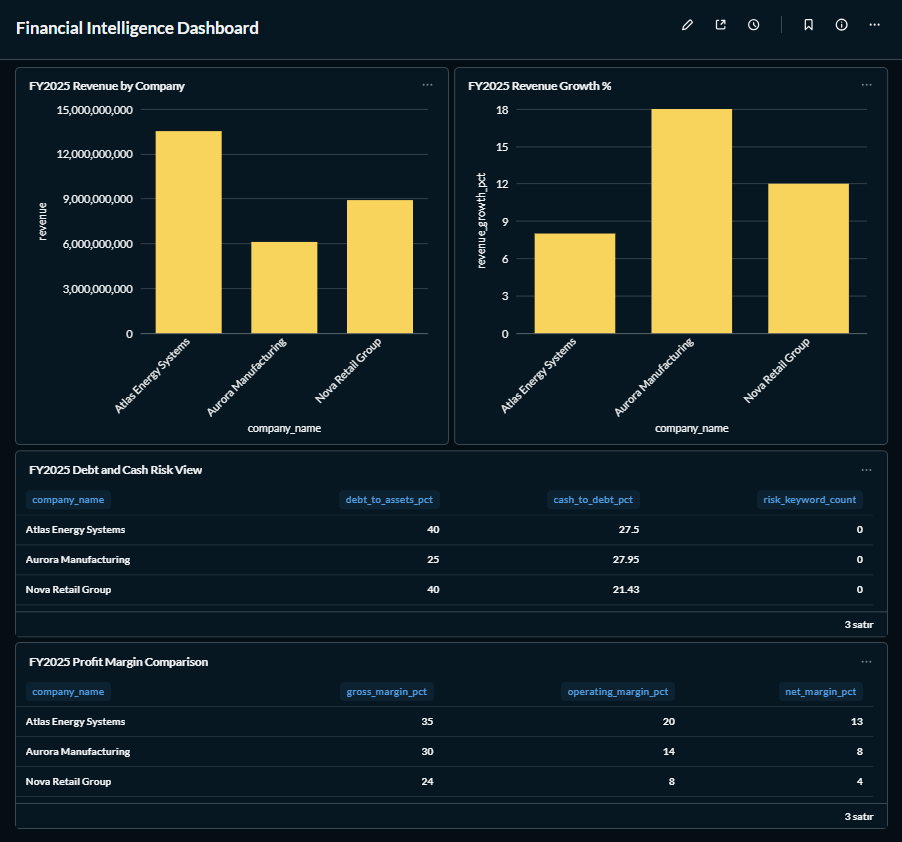

# AI-Assisted Financial Intelligence Pipeline

> **Note — Synthetic Data:** The current MVP uses fully synthetic, clearly labelled financial data for three fictional Turkish companies. No real financial documents or real company data are used at this stage. Real document ingestion is scoped for a future phase.

---

## Project Overview

An end-to-end analytics engineering portfolio project that converts financial data into structured metrics, SQL-based KPI models, dashboard-ready datasets, validation reports, and executive summaries.

The pipeline is intentionally built around clarity, traceability, and reproducibility rather than complexity. Every metric has a definition. Every transformation is traceable from source to final output. Every output can be explained to a non-technical stakeholder.

---

## Phase 2: Metabase + PostgreSQL Analytics Experiment

The MVP SQLite pipeline was extended with a self-contained Docker experiment
that connects a live Metabase OSS instance to a PostgreSQL analytics database
and builds a working financial intelligence dashboard on top of it.

### What was built

| Component | Detail |
|---|---|
| Docker Compose stack | Metabase OSS + PostgreSQL analytics DB + Metabase app DB, all local |
| PostgreSQL analytics DB | Star schema mirroring the MVP — `raw`, `analytics`, and `transforms` schemas |
| Python data loader | [`src/load_postgres_analytics.py`](src/load_postgres_analytics.py) — idempotent, reads `metabase/.env`, loads CSV, populates all tables |
| DDL script | [`metabase/postgres/sql/02_create_analytics_tables.sql`](metabase/postgres/sql/02_create_analytics_tables.sql) — creates all Phase 2 tables with `NUMERIC` types and foreign keys |
| Metabase SQL models | Three saved SQL models that simulate a layered transform flow |
| Dashboard | Financial Intelligence Dashboard with four KPI cards |

### Transform flow

Three saved SQL models were created in Metabase against the PostgreSQL analytics database:

| Model | Source SQL | Purpose |
|---|---|---|
| Transform 01 — Financial Metric Pivot | `metabase/transforms/01_financial_metric_pivot.sql` | Long → wide metric pivot (6 rows, 10 columns) |
| Transform 02 — Financial KPI Model | `metabase/transforms/02_financial_kpi_model.sql` | KPI calculations — margins, leverage, growth (6 rows, 22 columns) |
| Transform 03 — Dashboard Mart | `metabase/transforms/03_mart_company_financial_performance.sql` | Final mart identical in grain to the MVP SQLite mart |

These are Metabase saved SQL questions used to simulate the transform flow. The SQL executes at query time; results are not yet materialized to the `transforms` schema.

### Dashboard

The Financial Intelligence Dashboard was built directly on Transform 03 with four cards:
**FY2025 Revenue by Company** · **FY2025 Revenue Growth %** · **FY2025 Debt and Cash Risk View** · **FY2025 Profit Margin Comparison**



### Key files

- [`metabase/README.md`](metabase/README.md) — full setup and run instructions
- [`docs/28_DOCKER_POSTGRES_METABASE_PLAN.md`](docs/28_DOCKER_POSTGRES_METABASE_PLAN.md) — architecture plan and outcome log
- [`src/load_postgres_analytics.py`](src/load_postgres_analytics.py) — Python data loader
- [`metabase/postgres/sql/02_create_analytics_tables.sql`](metabase/postgres/sql/02_create_analytics_tables.sql) — PostgreSQL DDL

> **The original MVP SQLite pipeline remains intact.** Phase 2 is an additive experiment — no MVP scripts, SQL files, or the SQLite database were modified.

### Phase 2.1: Materialized Transform Mart

The final dashboard mart (Transform 03) was materialized into a real PostgreSQL table
under the `transforms` schema:

```
transforms.mart_company_financial_performance  — 6 rows (3 companies × 2 periods)
```

Run the materialization script (requires the Phase 2 Docker stack to be running):

```bash
python src/materialize_postgres_mart.py
```

See [`metabase/README.md`](metabase/README.md#phase-21-materialized-transform-mart) for full details.

---

## Phase 3: MarkItDown Document Ingestion

Raw financial documents (PDFs, Excel workbooks, Word reports, PowerPoint slides)
can now be converted to Markdown using Microsoft MarkItDown.

### What this phase adds

| Component | Detail |
|-----------|--------|
| [`src/document_converter.py`](src/document_converter.py) | Converts all supported files in `data/raw_documents/` to Markdown in `data/processed_markdown/` |
| Conversion manifest | `data/processed_markdown/conversion_manifest.csv` — one row per file with status, error, and timestamp |
| Supported formats | `.pdf` `.docx` `.pptx` `.xlsx` `.xls` `.csv` `.html` `.txt` `.md` |

### How to run

```bash
# Place documents in data/raw_documents/ then:
python src/document_converter.py
```

### Key points

- This phase **only converts documents to Markdown text**. Financial metric extraction is not implemented yet.
- Real documents are intentionally excluded from version control — `data/raw_documents/*` and `data/processed_markdown/*` are in `.gitignore`. Only `.gitkeep` files are committed.
- The converter is idempotent: re-running overwrites previous outputs safely.
- No data is sent to any external service. Conversion runs entirely locally.

See [`docs/29_MARKITDOWN_DOCUMENT_INGESTION_PLAN.md`](docs/29_MARKITDOWN_DOCUMENT_INGESTION_PLAN.md) for the full architecture note.

> **The MVP SQLite pipeline, PostgreSQL loader, and Docker Compose are not modified by Phase 3.**

---

## Phase 3.1: Markdown to Structured Financial Metrics

Markdown outputs produced by Phase 3 can now be parsed into structured financial
metric rows using deterministic regex-based extraction. No LLM, no external APIs.

### What this phase adds

| Component | Detail |
|-----------|--------|
| [`src/extract_financial_metrics.py`](src/extract_financial_metrics.py) | Reads `.md` files from `data/processed_markdown/`, extracts company, period, and 8 core metrics |
| `data/extracted/extracted_financial_metrics.csv` | Long-format metric rows — one per extracted value |
| `data/extracted/extraction_manifest.csv` | One row per source file with found/missing metrics and status |

### How to run

```bash
# After Phase 3 converter has produced .md files:
python src/extract_financial_metrics.py
```

### Key points

- Extraction is **fully deterministic** — same input always produces the same output.
- Supports labelled key-value patterns: `Revenue: 1,000,000`, `Company: Acme Corp`, `Period: FY2025`.
- Handles comma/space thousands separators, currency symbols, and European decimal formats.
- Files where company or period cannot be found are marked `failed` in the manifest; no rows are written for them.
- Files where some metrics are missing still produce rows for the metrics that were found.
- Generated CSV files are gitignored — only `.gitkeep` is committed.
- This prepares real document data for future loading into the PostgreSQL pipeline.

See [`docs/30_MARKDOWN_METRIC_EXTRACTION_PLAN.md`](docs/30_MARKDOWN_METRIC_EXTRACTION_PLAN.md) for supported aliases, output schema, and next steps.

> **No changes to MVP SQLite pipeline, PostgreSQL loader, or Docker Compose.**

---

## Phase 3.3: Document-Derived KPI Mart

Document-derived metrics can now be materialized into a KPI-ready PostgreSQL mart.
Running `src/materialize_document_kpi_mart.py` pivots the long-format analytics table
into wide columns and calculates 7 financial KPI ratios with a financial health flag —
making extracted data ready for dashboarding in Metabase.

### What this phase adds

| Component | Detail |
|-----------|--------|
| [`metabase/postgres/sql/08_create_document_kpi_mart.sql`](metabase/postgres/sql/08_create_document_kpi_mart.sql) | Creates `transforms.document_financial_metric_pivot` and `transforms.mart_document_company_financial_performance` |
| [`metabase/postgres/sql/09_verify_document_kpi_mart.sql`](metabase/postgres/sql/09_verify_document_kpi_mart.sql) | 14 SQL validation checks against the mart tables |
| [`src/materialize_document_kpi_mart.py`](src/materialize_document_kpi_mart.py) | Executes mart SQL, runs PASS/FAIL validation, idempotent |

### How to run

```bash
# Requires Docker stack running and Phase 3.2 already loaded:
python src/materialize_document_kpi_mart.py
```

### Key points

- Produces 7 KPI ratios: gross margin, operating margin, net margin, debt/assets,
  cash/debt, OCF margin, and cash conversion percentage.
- Each company-period is classified with a `financial_health_flag`:
  `stable`, `negative_income`, `high_debt`, or `low_cash_buffer`.
- All divisions use `NULLIF` to return NULL safely on zero denominators.
- Phase 2.1 table `transforms.mart_company_financial_performance` is **not touched**.
- Document-derived and synthetic marts remain separate until key alignment is validated.

See [`docs/32_DOCUMENT_DERIVED_KPI_MART_PLAN.md`](docs/32_DOCUMENT_DERIVED_KPI_MART_PLAN.md) for the full plan.

> **The MVP SQLite pipeline, Phase 2 synthetic tables, and Docker Compose are not modified.**

---

## Business Problem

A CFO, investment analyst, or BI team wants to compare multiple companies across reporting periods and answer questions such as:

- Which company is growing fastest?
- Which company is most profitable?
- Which company carries the most debt relative to assets?
- Is cash coverage of debt improving or deteriorating?
- Are management reports mentioning more risk language over time?

These questions require converting unstructured financial documents into a consistent analytical model — with validation to confirm the data can be trusted.

---

## Architecture

```
Synthetic CSV / Real Financial Documents (future)
        │
        ▼
  synthetic_data_generator.py
  (or: document extractor — Phase 2)
        │
        ▼
  database_loader.py
  → SQLite: dim_company, dim_period, dim_metric,
            fact_financial_metric, fact_document_source
        │
        ▼
  SQL KPI Models
  → sql/03_financial_kpis.sql
  → sql/05_mart_company_financial_performance.sql
        │
        ▼
  export_mart.py
  → data/final/mart_company_financial_performance.csv
        │
        ├──▶  validation.py        → reports/validation_report.md
        └──▶  report_generator.py  → reports/executive_summary.md
```

---

## Data Flow

| Step | Script | Input | Output |
|------|--------|-------|--------|
| 1 | `synthetic_data_generator.py` | Hard-coded definitions in `config.py` | `data/synthetic/synthetic_financial_metrics.csv` |
| 2 | `database_loader.py` | Synthetic CSV + `sql/01_schema.sql` | `data/final/financial_intelligence.sqlite` |
| 3 | `export_mart.py` | SQLite + `sql/05_mart_company_financial_performance.sql` | `data/final/mart_company_financial_performance.csv` |
| 4 | `validation.py` | Mart CSV | `reports/validation_report.md` |
| 5 | `report_generator.py` | Mart CSV | `reports/executive_summary.md` |

---

## Tech Stack

| Layer | Technology |
|-------|-----------|
| Language | Python 3.11+ |
| Data processing | pandas |
| MVP database | SQLite (via Python `sqlite3`) |
| Phase 2 database | PostgreSQL 15 (Docker) |
| SQL modeling | Raw SQL with CTEs and window functions |
| Reporting | Markdown (auto-generated) |
| Path management | `pathlib` |
| Testing | pytest (future) |
| Dashboard | Metabase OSS (Phase 2 — Docker, localhost:3000) |

No orchestration frameworks, no vector databases, no external APIs in the MVP.

---

## Repository Structure

```
financial-intelligence-pipeline/
│
├── data/
│   ├── raw_documents/          ← Real PDFs/Excel go here (not committed)
│   ├── processed_markdown/     ← Converted documents (not committed)
│   ├── synthetic/              ← Synthetic CSV output
│   │   └── synthetic_financial_metrics.csv
│   ├── extracted/              ← AI-extracted metrics (future phase)
│   └── final/                  ← SQLite database + mart CSV (not committed)
│       ├── financial_intelligence.sqlite
│       └── mart_company_financial_performance.csv
│
├── src/
│   ├── config.py               ← All paths, companies, metrics, periods
│   ├── synthetic_data_generator.py
│   ├── database_loader.py
│   ├── export_mart.py
│   ├── validation.py
│   ├── report_generator.py
│   └── run_pipeline.py         ← Single command to run everything
│
├── sql/
│   ├── 01_schema.sql           ← Database schema + dimension seed data
│   ├── 03_financial_kpis.sql   ← KPI calculation query (8 KPIs)
│   └── 05_mart_company_financial_performance.sql  ← Dashboard mart view
│
├── dashboard/
│   └── screenshots/            ← Dashboard previews (placeholder)
│
├── reports/
│   ├── validation_report.md    ← Auto-generated, 16 checks
│   └── executive_summary.md    ← Auto-generated business narrative
│
├── metabase/                   ← Phase 2 Metabase + PostgreSQL experiment
│   ├── README.md               ← Setup and run instructions for Phase 2
│   ├── docker-compose.yml      ← Docker stack: Metabase OSS + 2× PostgreSQL
│   ├── .env.example            ← Credential template (copy to .env locally)
│   ├── postgres/
│   │   ├── init/               ← Schema init script (runs on first container start)
│   │   └── sql/
│   │       ├── 02_create_analytics_tables.sql  ← Phase 2 DDL
│   │       └── 03_verify_loaded_data.sql        ← Row-count verification
│   ├── transforms/             ← PostgreSQL-compatible SQL for Metabase models
│   └── screenshots/
│       └── dashboard_overview.png
│
├── docs/                       ← Full design documentation (25+ files)
│
├── tests/                      ← Test suite (future)
├── CLAUDE.md                   ← AI assistant instructions
├── README.md
├── requirements.txt
└── .gitignore
```

---

## How to Run

### Prerequisites

```bash
pip install -r requirements.txt
```

### Run the full pipeline

```bash
python src/run_pipeline.py
```

This runs all five stages in sequence and stops immediately if any stage fails.

### Run individual stages

```bash
python src/synthetic_data_generator.py
python src/database_loader.py
python src/export_mart.py
python src/validation.py
python src/report_generator.py
```

### Configuration

All companies, periods, metrics, paths, and currency are defined in `src/config.py`. No other file should hardcode these values.

---

## Expected Outputs

After a successful pipeline run:

| File | Description | Rows | Committed |
|------|-------------|------|-----------|
| `data/synthetic/synthetic_financial_metrics.csv` | Long-format raw metrics | 48 | Yes |
| `data/final/financial_intelligence.sqlite` | Normalized SQLite database (6 tables) | — | **No** |
| `data/final/mart_company_financial_performance.csv` | Dashboard-ready wide table | 6 | **No** |
| `reports/validation_report.md` | 16-check data quality report | — | Yes |
| `reports/executive_summary.md` | Business narrative | — | Yes |

The mart table has 6 rows (3 companies × 2 periods) and 22 columns (6 identifiers + 8 raw metrics + 8 KPIs).

> **`data/final/` is excluded from version control.** The SQLite database and mart CSV are generated artifacts — they are not committed to the repository. Regenerate them at any time by running `python src/run_pipeline.py`.

---

## Metrics Dictionary

### Core Metrics (extracted or generated)

| Metric | Definition | Unit |
|--------|-----------|------|
| `revenue` | Total sales revenue for the period | TRY (millions) |
| `gross_profit` | Revenue minus cost of goods sold | TRY (millions) |
| `operating_profit` | Gross profit minus operating expenses | TRY (millions) |
| `net_income` | Profit after all expenses, interest, and tax | TRY (millions) |
| `total_assets` | Total value of all assets on the balance sheet | TRY (millions) |
| `total_debt` | Total interest-bearing debt (short + long term) | TRY (millions) |
| `cash` | Cash and cash equivalents | TRY (millions) |
| `operating_cash_flow` | Net cash generated from operations | TRY (millions) |

### Calculated KPIs (SQL layer)

| KPI | Formula | Business Meaning |
|-----|---------|-----------------|
| `revenue_growth_pct` | (Current − Prior) / Prior × 100 | Year-over-year revenue change |
| `gross_margin_pct` | Gross Profit / Revenue × 100 | Production efficiency |
| `operating_margin_pct` | Operating Profit / Revenue × 100 | Operational profitability |
| `net_margin_pct` | Net Income / Revenue × 100 | Bottom-line profitability |
| `debt_to_assets_pct` | Total Debt / Total Assets × 100 | Leverage and solvency risk |
| `cash_to_debt_pct` | Cash / Total Debt × 100 | Short-term liquidity buffer |
| `operating_cash_flow_to_net_income` | Operating Cash Flow / Net Income | Earnings quality (cash conversion) |
| `risk_keyword_count` | Count of risk-related terms in source documents | Document-level risk signal |

All KPIs use `NULLIF` in SQL to prevent division-by-zero errors. `revenue_growth_pct` is NULL for the first period (no prior period exists).

---

## Validation Summary

The pipeline runs 16 automated data quality checks against the mart table:

| Category | Checks |
|----------|--------|
| Shape | Row count = 6, Column count = 22 |
| Completeness | No nulls in raw metric columns |
| Uniqueness | No duplicate company-period combinations |
| Coverage | All 3 companies present, all 2 periods present |
| Grain | One row per company-period |
| Financial coherence | gross_profit < revenue, operating_profit < gross_profit, net_income < operating_profit |
| Balance sheet coherence | cash < total_assets, total_debt < total_assets |
| KPI logic | FY2024 growth is NULL, FY2025 growth is populated |
| Synthetic marker | risk_keyword_count = 0 |
| KPI range | All percentage KPIs within 0–100 |

Current status: **16/16 checks passed.**

Full results: [reports/validation_report.md](reports/validation_report.md)

---

## Executive Summary Output

The auto-generated executive summary covers:

- Fastest-growing company by revenue
- Most profitable company by net margin
- Largest company by revenue
- Lowest leverage (debt/assets)
- Per-company KPI tables
- Growth and profitability trend analysis
- Balance sheet and leverage comparison
- Cash coverage analysis
- Limitations and recommended next questions

Full report: [reports/executive_summary.md](reports/executive_summary.md)

---

## Companies in the MVP

| Company | Sector | Country | Note |
|---------|--------|---------|------|
| Aurora Manufacturing | Industrials | Turkey | Fictional — synthetic data |
| Nova Retail Group | Consumer Discretionary | Turkey | Fictional — synthetic data |
| Atlas Energy Systems | Energy | Turkey | Fictional — synthetic data |

---

## Limitations

1. **Synthetic data only.** All financial figures are generated, not extracted from real documents. They are internally consistent but not real.
2. **Two periods only.** Revenue growth can only be calculated for FY2025 vs FY2024. Trend analysis is limited.
3. **No real document ingestion yet.** PDF/Excel extraction, AI-assisted parsing, and confidence scoring are scoped for Phase 2.
4. **SQLite for the MVP pipeline.** The core pipeline uses SQLite, suitable for local development. Phase 2 adds a PostgreSQL backend via Docker for the Metabase experiment.
5. **Metabase state is not version-controlled.** The Phase 2 dashboard and saved SQL models exist inside the running Metabase instance. They must be recreated manually after a full Docker volume reset. The source SQL for all three models is committed under `metabase/transforms/`.
6. **Currency is TRY.** All figures are in Turkish Lira. No FX conversion is applied.
7. **Risk keyword count is 0.** The risk analysis module requires real document text. It is a placeholder in the MVP.

---

## Future Improvements

### Phase 2 — Metabase + PostgreSQL Experiment ✓ Complete
See the [Phase 2 section above](#phase-2-metabase--postgresql-analytics-experiment) and [`metabase/README.md`](metabase/README.md).

**Next optional step within Phase 2:** materialize Transform 03 output into
`transforms.mart_company_financial_performance` as a real PostgreSQL table,
and do a row-by-row comparison against the MVP mart CSV to confirm parity.

### Phase 3 — MarkItDown Document Ingestion ✓ Complete
Raw documents (.pdf, .docx, .xlsx, .pptx, .csv, .html) are converted to Markdown
via `src/document_converter.py`. A conversion manifest is produced after each run.
Real documents are gitignored. Metric extraction is the next step.

### Phase 3.1 — Markdown Metric Extraction ✓ Complete
Regex-based extraction from MarkItDown Markdown output. Produces
`extracted_financial_metrics.csv` and `extraction_manifest.csv`.
Supports 8 canonical metrics with multi-alias matching.

### Phase 3.2 — Extracted Metrics PostgreSQL Load ✓ Complete
Extracted Markdown metrics can now be loaded into PostgreSQL via
`python src/load_extracted_metrics_postgres.py`. Three tables are created:
`raw.extracted_financial_metrics`, `raw.extraction_manifest`, and
`analytics.document_extracted_financial_metric`. This connects
document-derived metrics to the analytics warehouse path and makes them
available for querying in Metabase alongside Phase 2 synthetic data.
See [`docs/31_EXTRACTED_METRICS_POSTGRES_LOAD_PLAN.md`](docs/31_EXTRACTED_METRICS_POSTGRES_LOAD_PLAN.md).

### Phase 3.3 — Document-Derived KPI Mart ✓ Complete

Document-derived financial metrics can now be materialized into KPI-ready PostgreSQL transform tables.

Created tables:

- `transforms.document_financial_metric_pivot`
- `transforms.mart_document_company_financial_performance`

The mart calculates:

- gross margin %
- operating margin %
- net margin %
- debt-to-assets %
- cash-to-debt %
- operating cash flow margin %
- cash conversion %
- financial health flag

This completes the first working document-to-KPI mart flow:

`raw document → MarkItDown → Markdown → extracted metrics → PostgreSQL → KPI mart`

### Phase 4 — Integrate Document-Derived Metrics with Existing Analytics Pipeline

- Validate extracted rows against the data contract in `docs/05_DATA_CONTRACTS.md`
- Compare document-derived metrics against the synthetic benchmark mart
- Create reconciliation checks between extracted and synthetic figures
- Prepare a unified reporting layer for synthetic and document-derived data
- Add low-confidence or ambiguous extraction handling

### Phase 5 — Expanded Coverage

- More companies and periods
- Quarterly reporting periods
- Multi-currency support with FX conversion
- Peer comparison benchmarks
- Automated anomaly detection

### Phase 6 — Production Deployment

- dbt for SQL transformation management
- Airflow or Prefect for pipeline orchestration
- API layer for programmatic access
- Automated alert system for validation failures

---

## Portfolio Message

This project demonstrates:

- Clean, layered data pipeline architecture (extract → load → transform → validate → report)
- SQL-based KPI modeling with CTEs and window functions
- Data contract enforcement and automated validation
- Metric traceability from source CSV to executive summary
- Professional documentation standards
- Reproducible, single-command execution

The pipeline produces outputs that are directly useful to a finance team: a validated mart table, a quality report, and a business narrative — without requiring any dashboard tool to be open.
