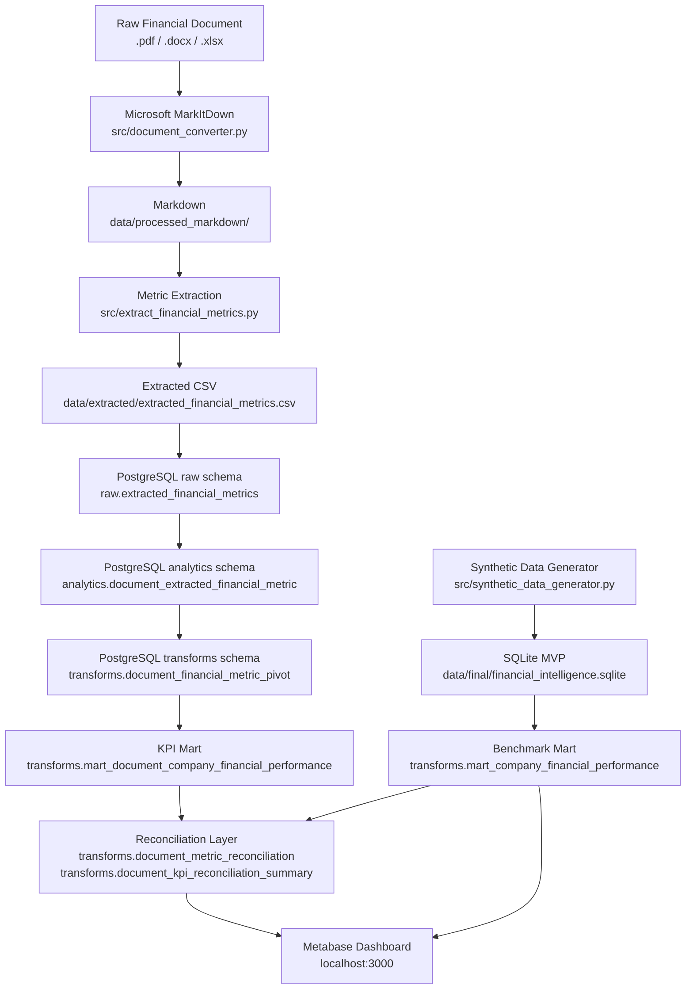

# AI-Assisted Financial Intelligence Pipeline

> **Note — Synthetic Data:** The current MVP uses fully synthetic, clearly labelled financial data for three fictional Turkish companies. The document ingestion pipeline (Phase 3+) uses a sample financial document containing `Demo Manufacturing` data, which is also clearly marked as synthetic.

---

## Project Story

**What problem does this project solve?**
Finance teams and BI engineers often receive raw financial documents — PDFs, Excel reports, Word files — and need to compare companies across reporting periods using consistent KPIs. Manually parsing these documents into structured metrics is error-prone and untraceable. This project automates that workflow end-to-end.

**How does the data arrive?**
Two parallel data paths feed the pipeline:
- A synthetic data generator produces benchmark financial metrics for three fictional companies across two reporting periods.
- Real (or sample) financial documents are dropped into `data/raw_documents/` and converted to Markdown via Microsoft MarkItDown.

**How is the data processed?**
The synthetic path loads directly into SQLite for the MVP, then into PostgreSQL for the analytics warehouse. The document path runs through deterministic regex-based metric extraction, producing a structured CSV from Markdown text.

**How does it enter the warehouse?**
Python loaders (idempotent, using `psycopg2`) write extracted metrics into the PostgreSQL `raw` schema. Analytics views are then built on top in the `analytics` schema.

**How are KPIs produced?**
PostgreSQL SQL scripts materialize KPI-ready transform marts under the `transforms` schema. KPIs include gross margin, operating margin, net margin, debt-to-assets, cash-to-debt, OCF margin, cash conversion, and a financial health flag.

**How is validation handled?**
Two validation layers exist: the SQLite MVP runs 16 automated checks on the mart table; the PostgreSQL document KPI mart runs 14 SQL-based PASS/FAIL checks against the materialized tables.

**How does it connect to Metabase?**
Metabase OSS runs locally via Docker and connects directly to the PostgreSQL analytics database. The `transforms` schema tables are the primary source for dashboard cards. A separate evaluation document assesses where native Metabase query-based Transforms could replace the current SQL-runner approach.

---

## Project Overview

This project builds an end-to-end financial intelligence pipeline that converts raw financial documents into structured financial metrics, loads them into PostgreSQL, materializes KPI-ready marts, validates the outputs, reconciles document-derived records against benchmark marts, and prepares the data for Metabase dashboards.

The pipeline is intentionally built around clarity, traceability, and reproducibility rather than complexity. Every metric has a definition. Every transformation is traceable from source to final output. Every output can be explained to a non-technical stakeholder.

---

## Architecture Overview



---

## Current Capabilities

| Capability | Status | Detail |
|---|---|---|
| Synthetic benchmark financial data pipeline | ✓ Complete | 3 companies × 2 periods, 8 metrics, 16 validation checks |
| SQLite MVP | ✓ Complete | Normalized schema, KPI mart, validation report, executive summary |
| PostgreSQL analytics warehouse | ✓ Complete | `raw`, `analytics`, `transforms` schemas via Docker |
| Metabase dashboard-ready marts | ✓ Complete | `transforms.mart_company_financial_performance` (synthetic benchmark) |
| MarkItDown document ingestion | ✓ Complete | Converts PDF/DOCX/XLSX/PPTX to Markdown locally |
| Markdown metric extraction | ✓ Complete | Deterministic regex extraction of 8 core financial metrics |
| Document-derived PostgreSQL loading | ✓ Complete | Idempotent loader into `raw` and `analytics` schemas |
| Document-derived KPI mart | ✓ Complete | `transforms.mart_document_company_financial_performance` with 7 KPI ratios |
| Reconciliation layer | ✓ Complete | Document mart LEFT JOIN against synthetic benchmark mart |
| Native Metabase Transform evaluation | ✓ Complete | Documentation-based evaluation of query-based Transform workflow |

---

## Metabase Positioning

- **Metabase is the BI and dashboard layer.** It connects to the PostgreSQL analytics database and renders the `transforms` schema tables as dashboard cards.
- **Transform logic is version-controlled outside Metabase.** SQL scripts in `metabase/postgres/sql/` and `metabase/transforms/` define all KPI models. Python runners in `src/` execute them against the live database.
- **Native Metabase query-based Transforms are evaluated as a candidate workflow.** See [`docs/34_NATIVE_METABASE_TRANSFORM_EVALUATION.md`](docs/34_NATIVE_METABASE_TRANSFORM_EVALUATION.md) for the full assessment of where Metabase Transforms can complement or replace the current SQL-runner pattern.
- **Not all transforms were created inside the Metabase UI.** The Phase 2 saved SQL models simulate a transform flow but execute at query time. Materialized transforms are created by the Python runners. The project is transparent about this distinction.

---

## How to Run the Full Local Pipeline

### Prerequisites

```powershell
pip install -r requirements.txt
```

### 1 — Start Docker services

```powershell
docker compose --env-file metabase/.env -f metabase/docker-compose.yml up -d
```

### 2 — Run the full pipeline sequence

```powershell
# SQLite MVP (synthetic benchmark data)
python src/run_pipeline.py

# Convert raw financial documents to Markdown
python src/document_converter.py

# Extract structured metrics from Markdown
python src/extract_financial_metrics.py

# Load extracted metrics into PostgreSQL
python src/load_extracted_metrics_postgres.py

# Materialize document-derived KPI mart
python src/materialize_document_kpi_mart.py

# Materialize reconciliation layer
python src/materialize_document_reconciliation.py
```

### 3 — Open Metabase

Navigate to [http://localhost:3000](http://localhost:3000) and connect to the PostgreSQL analytics database.

### Configuration

All companies, periods, metrics, paths, and currency are defined in `src/config.py`. No other file should hardcode these values.

---

## Phase 2: Metabase + PostgreSQL Analytics Experiment

The MVP SQLite pipeline was extended with a self-contained Docker experiment
that connects a live Metabase OSS instance to a PostgreSQL analytics database
and builds a working financial intelligence dashboard on top of it.

### What was built

| Component | Detail |
|---|---|
| Docker Compose stack | Metabase OSS + PostgreSQL analytics DB + Metabase app DB, all local |
| PostgreSQL analytics DB | Star schema mirroring the MVP — `raw`, `analytics`, and `transforms` schemas |
| Python data loader | [`src/load_postgres_analytics.py`](src/load_postgres_analytics.py) — idempotent, reads `metabase/.env`, loads CSV, populates all tables |
| DDL script | [`metabase/postgres/sql/02_create_analytics_tables.sql`](metabase/postgres/sql/02_create_analytics_tables.sql) — creates all Phase 2 tables with `NUMERIC` types and foreign keys |
| Metabase SQL models | Three saved SQL models that simulate a layered transform flow |
| Dashboard | Financial Intelligence Dashboard with four KPI cards |

### Transform flow

Three saved SQL models were created in Metabase against the PostgreSQL analytics database:

| Model | Source SQL | Purpose |
|---|---|---|
| Transform 01 — Financial Metric Pivot | `metabase/transforms/01_financial_metric_pivot.sql` | Long → wide metric pivot (6 rows, 10 columns) |
| Transform 02 — Financial KPI Model | `metabase/transforms/02_financial_kpi_model.sql` | KPI calculations — margins, leverage, growth (6 rows, 22 columns) |
| Transform 03 — Dashboard Mart | `metabase/transforms/03_mart_company_financial_performance.sql` | Final mart identical in grain to the MVP SQLite mart |

These are Metabase saved SQL questions used to simulate the transform flow. The SQL executes at query time; results are not yet materialized to the `transforms` schema.

### Dashboard

The Financial Intelligence Dashboard was built directly on Transform 03 with four cards:
**FY2025 Revenue by Company** · **FY2025 Revenue Growth %** · **FY2025 Debt and Cash Risk View** · **FY2025 Profit Margin Comparison**


### Key files

- [`metabase/README.md`](metabase/README.md) — full setup and run instructions
- [`docs/28_DOCKER_POSTGRES_METABASE_PLAN.md`](docs/28_DOCKER_POSTGRES_METABASE_PLAN.md) — architecture plan and outcome log
- [`src/load_postgres_analytics.py`](src/load_postgres_analytics.py) — Python data loader
- [`metabase/postgres/sql/02_create_analytics_tables.sql`](metabase/postgres/sql/02_create_analytics_tables.sql) — PostgreSQL DDL

> **The original MVP SQLite pipeline remains intact.** Phase 2 is an additive experiment — no MVP scripts, SQL files, or the SQLite database were modified.

### Phase 2.1: Materialized Transform Mart

The final dashboard mart (Transform 03) was materialized into a real PostgreSQL table
under the `transforms` schema:

```
transforms.mart_company_financial_performance  — 6 rows (3 companies × 2 periods)
```

Run the materialization script (requires the Phase 2 Docker stack to be running):

```powershell
python src/materialize_postgres_mart.py
```

See [`metabase/README.md`](metabase/README.md#phase-21-materialized-transform-mart) for full details.

---

## Phase 3: MarkItDown Document Ingestion

Raw financial documents (PDFs, Excel workbooks, Word reports, PowerPoint slides)
can now be converted to Markdown using Microsoft MarkItDown.

### What this phase adds

| Component | Detail |
|-----------|--------|
| [`src/document_converter.py`](src/document_converter.py) | Converts all supported files in `data/raw_documents/` to Markdown in `data/processed_markdown/` |
| Conversion manifest | `data/processed_markdown/conversion_manifest.csv` — one row per file with status, error, and timestamp |
| Supported formats | `.pdf` `.docx` `.pptx` `.xlsx` `.xls` `.csv` `.html` `.txt` `.md` |

### How to run

```powershell
# Place documents in data/raw_documents/ then:
python src/document_converter.py
```

### Key points

- This phase **only converts documents to Markdown text**. Financial metric extraction is not implemented yet.
- Real documents are intentionally excluded from version control — `data/raw_documents/*` and `data/processed_markdown/*` are in `.gitignore`. Only `.gitkeep` files are committed.
- The converter is idempotent: re-running overwrites previous outputs safely.
- No data is sent to any external service. Conversion runs entirely locally.

See [`docs/29_MARKITDOWN_DOCUMENT_INGESTION_PLAN.md`](docs/29_MARKITDOWN_DOCUMENT_INGESTION_PLAN.md) for the full architecture note.

> **The MVP SQLite pipeline, PostgreSQL loader, and Docker Compose are not modified by Phase 3.**

---

## Phase 3.1: Markdown to Structured Financial Metrics

Markdown outputs produced by Phase 3 can now be parsed into structured financial
metric rows using deterministic regex-based extraction. No LLM, no external APIs.

### What this phase adds

| Component | Detail |
|-----------|--------|
| [`src/extract_financial_metrics.py`](src/extract_financial_metrics.py) | Reads `.md` files from `data/processed_markdown/`, extracts company, period, and 8 core metrics |
| `data/extracted/extracted_financial_metrics.csv` | Long-format metric rows — one per extracted value |
| `data/extracted/extraction_manifest.csv` | One row per source file with found/missing metrics and status |

### How to run

```powershell
# After Phase 3 converter has produced .md files:
python src/extract_financial_metrics.py
```

### Key points

- Extraction is **fully deterministic** — same input always produces the same output.
- Supports labelled key-value patterns: `Revenue: 1,000,000`, `Company: Acme Corp`, `Period: FY2025`.
- Handles comma/space thousands separators, currency symbols, and European decimal formats.
- Files where company or period cannot be found are marked `failed` in the manifest; no rows are written for them.
- Files where some metrics are missing still produce rows for the metrics that were found.
- Generated CSV files are gitignored — only `.gitkeep` is committed.
- This prepares real document data for future loading into the PostgreSQL pipeline.

See [`docs/30_MARKDOWN_METRIC_EXTRACTION_PLAN.md`](docs/30_MARKDOWN_METRIC_EXTRACTION_PLAN.md) for supported aliases, output schema, and next steps.

> **No changes to MVP SQLite pipeline, PostgreSQL loader, or Docker Compose.**

---

## Phase 3.3: Document-Derived KPI Mart

Document-derived metrics can now be materialized into a KPI-ready PostgreSQL mart.
Running `src/materialize_document_kpi_mart.py` pivots the long-format analytics table
into wide columns and calculates 7 financial KPI ratios with a financial health flag —
making extracted data ready for dashboarding in Metabase.

### What this phase adds

| Component | Detail |
|-----------|--------|
| [`metabase/postgres/sql/08_create_document_kpi_mart.sql`](metabase/postgres/sql/08_create_document_kpi_mart.sql) | Creates `transforms.document_financial_metric_pivot` and `transforms.mart_document_company_financial_performance` |
| [`metabase/postgres/sql/09_verify_document_kpi_mart.sql`](metabase/postgres/sql/09_verify_document_kpi_mart.sql) | 14 SQL validation checks against the mart tables |
| [`src/materialize_document_kpi_mart.py`](src/materialize_document_kpi_mart.py) | Executes mart SQL, runs PASS/FAIL validation, idempotent |

### How to run

```powershell
# Requires Docker stack running and Phase 3.2 already loaded:
python src/materialize_document_kpi_mart.py
```

### Key points

- Produces 7 KPI ratios: gross margin, operating margin, net margin, debt/assets,
  cash/debt, OCF margin, and cash conversion percentage.
- Each company-period is classified with a `financial_health_flag`:
  `stable`, `negative_income`, `high_debt`, or `low_cash_buffer`.
- All divisions use `NULLIF` to return NULL safely on zero denominators.
- Phase 2.1 table `transforms.mart_company_financial_performance` is **not touched**.
- Document-derived and synthetic marts remain separate until key alignment is validated.

See [`docs/32_DOCUMENT_DERIVED_KPI_MART_PLAN.md`](docs/32_DOCUMENT_DERIVED_KPI_MART_PLAN.md) for the full plan.

> **The MVP SQLite pipeline, Phase 2 synthetic tables, and Docker Compose are not modified.**

---

## Phase 4: Document-Derived Metrics Reconciliation Layer

Document-derived KPI records can now be reconciled against the existing
synthetic benchmark mart to detect company-period matches, measure KPI
differences, and report a match rate.

### What this phase adds

| Component | Detail |
|-----------|--------|
| [`metabase/postgres/sql/10_create_document_reconciliation.sql`](metabase/postgres/sql/10_create_document_reconciliation.sql) | Creates `transforms.document_metric_reconciliation` and `transforms.document_kpi_reconciliation_summary` |
| [`metabase/postgres/sql/11_verify_document_reconciliation.sql`](metabase/postgres/sql/11_verify_document_reconciliation.sql) | 6 SQL validation checks against the reconciliation tables |
| [`src/materialize_document_reconciliation.py`](src/materialize_document_reconciliation.py) | Executes reconciliation SQL, runs PASS/FAIL validation, idempotent |

### How to run

```powershell
# Requires Docker stack running, Phase 2.1 and Phase 3.3 already materialized:
python src/materialize_document_reconciliation.py
```

### Key points

- The reconciliation is a `LEFT JOIN` from the document mart to the synthetic
  mart on `company_name` and `period_label`. All document records are preserved
  regardless of match outcome.
- `match_status` is `matched` when a synthetic row is found, or
  `unmatched_company_or_period` when no synthetic row matches.
- Difference fields (`revenue_difference`, `gross_margin_difference`, etc.) are
  populated only for matched records. Unmatched records show NULL — which is
  correct, not a failure.
- **Current sample produces an unmatched status** because `Demo Manufacturing`
  is not in the synthetic benchmark company set (`Aurora Manufacturing`,
  `Nova Retail Group`, `Atlas Energy Systems`). This is **expected behavior**
  and proves the reconciliation layer handles unmatched document records safely.
- `match_rate_pct = 0.00` with `unmatched_records = 1` is the correct and
  validated output for the current dataset.
- All percentage differences use `NULLIF` to prevent division-by-zero.
- Phase 2.1 and Phase 3.3 tables are not touched.

### Tables created

```
transforms.document_metric_reconciliation         — 1 row (current sample)
transforms.document_kpi_reconciliation_summary    — 1 row (aggregate summary)
```

See [`docs/33_DOCUMENT_RECONCILIATION_PLAN.md`](docs/33_DOCUMENT_RECONCILIATION_PLAN.md)
for the full plan, matching strategy, and next steps.

---

## Phase 4.5 — Native Metabase Transform Evaluation

The repository now includes a documentation-based evaluation of how the existing
PostgreSQL-first transform marts could map to native Metabase query-based Transforms.

See:

- [`docs/34_NATIVE_METABASE_TRANSFORM_EVALUATION.md`](docs/34_NATIVE_METABASE_TRANSFORM_EVALUATION.md)

This keeps the project positioning honest:

- Transform logic is currently implemented with version-controlled PostgreSQL SQL scripts and Python runners.
- Metabase is used as the dashboard and BI layer.
- Native Metabase Transforms are evaluated as a candidate workflow for analyst-owned marts.

---

## Business Problem

A CFO, investment analyst, or BI team wants to compare multiple companies across reporting periods and answer questions such as:

- Which company is growing fastest?
- Which company is most profitable?
- Which company carries the most debt relative to assets?
- Is cash coverage of debt improving or deteriorating?
- Are management reports mentioning more risk language over time?

These questions require converting unstructured financial documents into a consistent analytical model — with validation to confirm the data can be trusted.

---

## Data Flow

| Step | Script | Input | Output |
|------|--------|-------|--------|
| 1 | `synthetic_data_generator.py` | Hard-coded definitions in `config.py` | `data/synthetic/synthetic_financial_metrics.csv` |
| 2 | `database_loader.py` | Synthetic CSV + `sql/01_schema.sql` | `data/final/financial_intelligence.sqlite` |
| 3 | `export_mart.py` | SQLite + `sql/05_mart_company_financial_performance.sql` | `data/final/mart_company_financial_performance.csv` |
| 4 | `validation.py` | Mart CSV | `reports/validation_report.md` |
| 5 | `report_generator.py` | Mart CSV | `reports/executive_summary.md` |
| 6 | `document_converter.py` | `data/raw_documents/` | `data/processed_markdown/*.md` |
| 7 | `extract_financial_metrics.py` | `data/processed_markdown/*.md` | `data/extracted/extracted_financial_metrics.csv` |
| 8 | `load_extracted_metrics_postgres.py` | Extracted CSV | PostgreSQL `raw` + `analytics` schemas |
| 9 | `materialize_document_kpi_mart.py` | `analytics` schema | `transforms.mart_document_company_financial_performance` |
| 10 | `materialize_document_reconciliation.py` | Both transform marts | `transforms.document_metric_reconciliation` |

---

## Tech Stack

| Layer | Technology |
|-------|-----------|
| Language | Python 3.11+ |
| Data processing | pandas |
| MVP database | SQLite (via Python `sqlite3`) |
| Analytics warehouse | PostgreSQL 15 (Docker) |
| SQL modeling | Raw SQL with CTEs and window functions |
| Document ingestion | Microsoft MarkItDown |
| Reporting | Markdown (auto-generated) |
| Path management | `pathlib` |
| Dashboard | Metabase OSS (Docker, localhost:3000) |

No orchestration frameworks, no vector databases, no external APIs in the MVP.

---

## Repository Structure

```
financial-intelligence-pipeline/
│
├── data/
│   ├── raw_documents/          ← Real PDFs/Excel go here (not committed)
│   ├── processed_markdown/     ← Converted documents (not committed)
│   ├── synthetic/              ← Synthetic CSV output
│   │   └── synthetic_financial_metrics.csv
│   ├── extracted/              ← Extracted metrics from documents (not committed)
│   └── final/                  ← SQLite database + mart CSV (not committed)
│       ├── financial_intelligence.sqlite
│       └── mart_company_financial_performance.csv
│
├── src/
│   ├── config.py                          ← All paths, companies, metrics, periods
│   ├── synthetic_data_generator.py
│   ├── database_loader.py
│   ├── export_mart.py
│   ├── validation.py
│   ├── report_generator.py
│   ├── run_pipeline.py                    ← Single command for SQLite MVP
│   ├── document_converter.py              ← MarkItDown document ingestion
│   ├── extract_financial_metrics.py       ← Markdown metric extraction
│   ├── load_extracted_metrics_postgres.py ← PostgreSQL loader for extracted metrics
│   ├── materialize_document_kpi_mart.py   ← Document KPI mart runner
│   └── materialize_document_reconciliation.py ← Reconciliation layer runner
│
├── sql/
│   ├── 01_schema.sql           ← Database schema + dimension seed data
│   ├── 03_financial_kpis.sql   ← KPI calculation query (8 KPIs)
│   └── 05_mart_company_financial_performance.sql  ← Dashboard mart view
│
├── metabase/                   ← Metabase + PostgreSQL experiment
│   ├── README.md               ← Setup and run instructions
│   ├── docker-compose.yml      ← Docker stack: Metabase OSS + 2× PostgreSQL
│   ├── .env.example            ← Credential template (copy to .env locally)
│   ├── postgres/
│   │   ├── init/               ← Schema init script (runs on first container start)
│   │   └── sql/                ← DDL scripts (02–11)
│   ├── transforms/             ← PostgreSQL-compatible SQL for Metabase models
│   └── screenshots/
│       └── dashboard_overview.png
│
├── docs/                       ← Full design documentation (35+ files)
├── reports/
│   ├── validation_report.md    ← Auto-generated, 16 checks
│   └── executive_summary.md    ← Auto-generated business narrative
│
├── tests/                      ← Test suite (future)
├── CLAUDE.md                   ← AI assistant instructions
├── README.md
├── requirements.txt
└── .gitignore
```

---

## Expected Outputs

After a successful full pipeline run:

| File / Table | Description | Rows | Committed |
|---|---|---|---|
| `data/synthetic/synthetic_financial_metrics.csv` | Long-format raw metrics | 48 | Yes |
| `data/final/financial_intelligence.sqlite` | Normalized SQLite database (6 tables) | — | No |
| `data/final/mart_company_financial_performance.csv` | Dashboard-ready wide table | 6 | No |
| `reports/validation_report.md` | 16-check data quality report | — | Yes |
| `reports/executive_summary.md` | Business narrative | — | Yes |
| `transforms.mart_company_financial_performance` | Synthetic benchmark KPI mart | 6 | — |
| `transforms.mart_document_company_financial_performance` | Document-derived KPI mart | 1 (sample) | — |
| `transforms.document_metric_reconciliation` | Document vs benchmark reconciliation | 1 (sample) | — |
| `transforms.document_kpi_reconciliation_summary` | Aggregate reconciliation summary | 1 (sample) | — |

---

## Metrics Dictionary

### Core Metrics (extracted or generated)

| Metric | Definition | Unit |
|--------|-----------|------|
| `revenue` | Total sales revenue for the period | TRY (millions) |
| `gross_profit` | Revenue minus cost of goods sold | TRY (millions) |
| `operating_profit` | Gross profit minus operating expenses | TRY (millions) |
| `net_income` | Profit after all expenses, interest, and tax | TRY (millions) |
| `total_assets` | Total value of all assets on the balance sheet | TRY (millions) |
| `total_debt` | Total interest-bearing debt (short + long term) | TRY (millions) |
| `cash` | Cash and cash equivalents | TRY (millions) |
| `operating_cash_flow` | Net cash generated from operations | TRY (millions) |

### Calculated KPIs (SQL layer)

| KPI | Formula | Business Meaning |
|-----|---------|-----------------|
| `revenue_growth_pct` | (Current − Prior) / Prior × 100 | Year-over-year revenue change |
| `gross_margin_pct` | Gross Profit / Revenue × 100 | Production efficiency |
| `operating_margin_pct` | Operating Profit / Revenue × 100 | Operational profitability |
| `net_margin_pct` | Net Income / Revenue × 100 | Bottom-line profitability |
| `debt_to_assets_pct` | Total Debt / Total Assets × 100 | Leverage and solvency risk |
| `cash_to_debt_pct` | Cash / Total Debt × 100 | Short-term liquidity buffer |
| `operating_cash_flow_to_net_income` | Operating Cash Flow / Net Income | Earnings quality (cash conversion) |
| `risk_keyword_count` | Count of risk-related terms in source documents | Document-level risk signal |

All KPIs use `NULLIF` in SQL to prevent division-by-zero errors. `revenue_growth_pct` is NULL for the first period (no prior period exists).

---

## Validation Summary

The pipeline runs 16 automated data quality checks against the SQLite mart table:

| Category | Checks |
|----------|--------|
| Shape | Row count = 6, Column count = 22 |
| Completeness | No nulls in raw metric columns |
| Uniqueness | No duplicate company-period combinations |
| Coverage | All 3 companies present, all 2 periods present |
| Grain | One row per company-period |
| Financial coherence | gross_profit < revenue, operating_profit < gross_profit, net_income < operating_profit |
| Balance sheet coherence | cash < total_assets, total_debt < total_assets |
| KPI logic | FY2024 growth is NULL, FY2025 growth is populated |
| Synthetic marker | risk_keyword_count = 0 |
| KPI range | All percentage KPIs within 0–100 |

Current status: **16/16 checks passed.**

Full results: [reports/validation_report.md](reports/validation_report.md)

---

## Executive Summary Output

The auto-generated executive summary covers:

- Fastest-growing company by revenue
- Most profitable company by net margin
- Largest company by revenue
- Lowest leverage (debt/assets)
- Per-company KPI tables
- Growth and profitability trend analysis
- Balance sheet and leverage comparison
- Cash coverage analysis
- Limitations and recommended next questions

Full report: [reports/executive_summary.md](reports/executive_summary.md)

---

## Companies in the MVP

| Company | Sector | Country | Note |
|---------|--------|---------|------|
| Aurora Manufacturing | Industrials | Turkey | Fictional — synthetic data |
| Nova Retail Group | Consumer Discretionary | Turkey | Fictional — synthetic data |
| Atlas Energy Systems | Energy | Turkey | Fictional — synthetic data |
| Demo Manufacturing | — | — | Sample document company — synthetic data |

---

## Limitations

1. **Synthetic data only.** All financial figures are generated or derived from sample documents, not real financial statements.
2. **Two periods only.** Revenue growth can only be calculated for FY2025 vs FY2024. Trend analysis is limited.
3. **SQLite for the MVP pipeline.** Suitable for local development. Phase 2 adds a PostgreSQL backend via Docker.
4. **Metabase state is not version-controlled.** Dashboard cards and saved SQL models exist inside the running Metabase instance. The source SQL for all models is committed under `metabase/transforms/`.
5. **Currency is TRY.** All synthetic figures are in Turkish Lira. No FX conversion is applied.
6. **Risk keyword count is 0.** The risk analysis module requires real document text. It is a placeholder in the MVP.
7. **Demo Manufacturing is unmatched.** The sample document company does not exist in the synthetic benchmark mart. This is expected and validates the reconciliation layer's handling of unmatched records.

---

## Future Improvements

### Phase 5 — Expanded Coverage

- More companies and periods
- Quarterly reporting periods
- Multi-currency support with FX conversion
- Peer comparison benchmarks
- Automated anomaly detection

### Phase 6 — Production Deployment

- dbt for SQL transformation management
- Airflow or Prefect for pipeline orchestration
- API layer for programmatic access
- Automated alert system for validation failures

---

## Portfolio Summary

This project demonstrates analytics engineering, SQL transformation design, PostgreSQL modeling, document ingestion via Microsoft MarkItDown, deterministic metric extraction, data validation, reconciliation between document-derived and benchmark data, and BI-readiness using Metabase.

It shows how a small analytics team can build a traceable, reproducible financial intelligence workflow — from raw documents to validated KPI marts — without requiring heavy orchestration frameworks or external APIs.

| Skill demonstrated | Where |
|---|---|
| Analytics engineering | SQL KPI models, materialized marts, layered schemas |
| PostgreSQL modeling | `raw` → `analytics` → `transforms` schema design |
| Document ingestion | Microsoft MarkItDown, conversion manifest |
| Metric extraction | Deterministic regex pipeline, extraction manifest |
| Data validation | 16-check SQLite validation + 14-check PostgreSQL mart validation |
| Reconciliation design | LEFT JOIN reconciliation, match rate reporting |
| BI integration | Metabase OSS dashboard, native Transform evaluation |
| Reproducibility | Single-command pipeline, Docker Compose stack, idempotent loaders |
